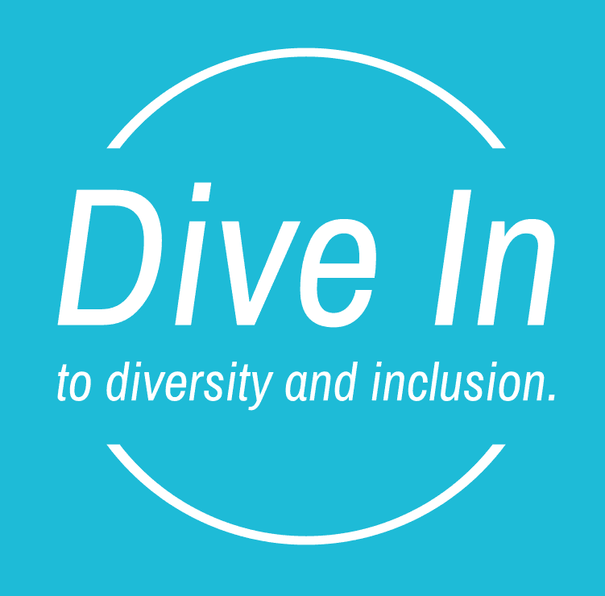

# Dive In to Diversity and Inclusion.

## Overview
This website will provide a basic understanding of diversity and inclusion relating to the workplace including educational settings. Links will be provided for the user to investigate current legislation. Relevant support groups will be identified and links provided. In the future the website may provide information on the historical developement of diversity and inclusion.

## Target Audience.

The target audience will include:

1. New and existing small to medium sized businesses
2. Education proffesionals and students
3. Individuals with an interest in gaining a basic understanding of issues involving diversity and inclusion.

## User Stories

### MUST:

#### User story 1 : 
**AS A** new/existing small/medium business owner **I WANT** a concise definition of diversity and inclusion **SO THAT** I can be a good employer.
##### Description:
A new/existing small/medium business owner requires information to ensure a good working environment. 
##### Assessment Criteria:
1. The website will provide a description of Diversity & Inclusion including easy to understand, bulleted highlights.
2. The website will provide a contact form for the user to request further information.

#### User story 2: 
**AS A** teacher **I WANT** examples of minority groups **SO THAT** I can better understand the needs of my students.
##### Description:
An education proffesional requires information on minority groups to better inform lesson planning, classroom management etc. Perhaps a newly qualified teacher or one that has moved to a new area with different demographics. This person will have undertaken diversity & inclusion training as part of their proffessional cpd.
##### Assessment Criteria:
1. The website will provide a list of minority groups.
2. The website will provide a contact form for the user to request further information.

## User Stories

### SHOULD:

#### User story 1: 
**AS AN** individual **I WANT** access to information on legislation **SO THAT** I can ensure my business/workplace/social envirnonment is compliant.
##### Description:
A business owner/compliance manager/employee needs information on current legislation to ensure their workplace is compliant or to inform an improvement strategy.
##### Assessment Criteria:
1. The website will provide a links to external sites so that the user can have up to date information on legislation and compliance.
2. The website will provide a contact form for the user to request further information.

#### User story 2: 
**AS A** individual **I WANT** information about support groups **SO THAT** I can decide whether to persue a grievance.
##### Description:
A individual has experienced a situation in which they believe they have been subject to bias, conscious or unconscious, and want to decide if they have basis to initiate a grievance.
##### Assessment Criteria:
1. The website will identify and provide links to support groups.
2. The website will provide a contact form for the user to request further information.

### COULD:

#### User story 1: 
**AS AN** academic **I WANT** information on the historical develpoment of diversity and inclusion **SO THAT** I can better inform myself for my upcoming paper.
##### Description:
An academic is writing a paper on diversity and inclusion and needs information on the historical devlopement on the culture and legislation around it. 
##### Assessment Criteria:
1. The website will provide an historical timeline with examples.
2. The website will provide a contact form for the user to request further information.

#### User story 2: 
**AS A** ?? **I WANT** ??**SO THAT** ??