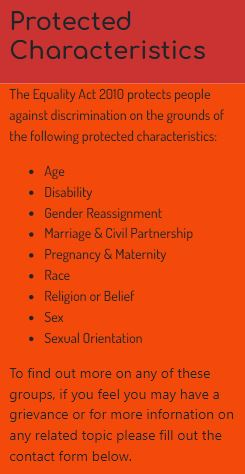

# Dive In to Diversity and Inclusion.

## Overview
This website will provide a basic understanding of diversity and inclusion relating to the workplace including educational settings. Links will be provided for the user to investigate current legislation. Relevant websites will be identified and links provided. In the future the website may provide information on the historical developement of diversity and inclusion as well as links to support groups for all protected characteristics.

## Target Audience.

The target audience will include:

1. New and existing small to medium sized businesses
2. Education proffesionals and students
3. Individuals with an interest in gaining a basic understanding of issues involving diversity and inclusion.

## User Stories

### MUST:

#### User story 1 : 
**AS A** site user **I WANT** easy navigation **SO THAT** I can quickly find the information I am looking for.
##### Description:
A user of the website wants to intuitively be  able to navigate the site.
##### Assessment Criteria:
1. The website will provide a navbar.
2. The nav bar will be at the top of the page.

#### User story 2: 
**AS A** site user **I WANT** to be able to access more information **SO THAT** I can fulfill my particular need.
##### Description:
Users need a variety of information and the site will be able to field requests for enquiries beyond the scope of the content. Also there will be links to external webpages.
##### Assessment Criteria:
1. The website will provide a contact form for requests
2. The website will provide links to external pages for further information and support.

### SHOULD:

#### User story 1 : 
**AS A** new/existing small/medium business owner **I WANT** a concise definition of diversity and inclusion **SO THAT** I can be a good employer.
##### Description:
A new/existing small/medium business owner requires information to ensure a good working environment. 
##### Assessment Criteria:
1. The website will provide a description of Diversity & Inclusion.
2. The website will also provide 2 external links specifically for employers

#### User story 2: 
**AS A** teacher **I WANT** examples of protected characteristics **SO THAT** I can better understand the needs of my students.
##### Description:
An education proffesional requires information on minority groups to better inform lesson planning, classroom management etc. Perhaps a newly qualified teacher or one that has moved to a new area with different demographics. This person will have undertaken diversity & inclusion training as part of their proffessional cpd.
##### Assessment Criteria:
1. The website will provide a list of protected characteristics.
2. The site provides a link to an external site targetted at education proffessionals.

### COULD:

#### User story 1: 
**AS A** individual **I WANT** to know where to get further info and support **SO THAT** I can decide whether to persue a grievance.
##### Description:
A individual has experienced a situation in which they believe they have been subject to bias, conscious or unconscious, and want to decide if they have basis to initiate a grievance.
##### Assessment Criteria:
1. The website will identify and provide links to support groups for each of the protected characteristics.
2. The website will provide a contact form for the user to request further information.

#### User story 2: 
**AS AN** academic **I WANT** information on the historical develpoment of diversity and inclusion **SO THAT** I can better inform myself for my upcoming paper.
##### Description:
An academic is writing a paper on diversity and inclusion and needs information on the historical devlopement on the culture and legislation around it. 
##### Assessment Criteria:
1. The website will provide an historical timeline with examples.
2. The website will provide a contact form for the user to request further information.

## Design Decisions

### Wireframes
V1 

Adjusted for contact form, rule of 3, device sizes added for my ease of reference.

V2 

Note: final structure altered considerably.

### Accessibility

Images : will have alt text. ** I HAVE NOT BEEN ABLE TO ADD ALT TEXT TO BACKGROUND IMAGES**

Bootstrap code : has built in aria labels.

Colour palette: Initially I had a logo - see above - and matched the colour scheme to that using the pippete on the colour picker. However I have not used the logo as yet on the page so I have chosen a bold palette to match the rainbow theme of the LGBT+++ movement.To contrast text better I toned doen the initial choices of colours and increased the font weight. Text colour is black.

## Features Implementation
### Core Features

1. 

The website has a navbar at the top of the page that provides links to other sections of the page.

2. 
The website has links to external sites giving more information for employers and educators as well as a link to a general advice site. The contact form can request other information.

### Advanced Features

1. 

The site provides a link to en external website for information as well as an outline of the Equality Act 2010. Also links detailed in Core Features.

2. 
The site provides a list of protected characteristics. Also links detailed in Core Features.

### Optional Features

Are not included at this time.

## Testing and Validation

#### Testing
All links tested and shown to be working in gitpod environment and on deployed site.

#### Validation

HTML validated using [markup validator](https://validator.w3.org/)
The following results have been found 
Both relate to p elements - extra closing tags. I have rectified by targetting div classes. 

CSS validated using [css validator](assets/images/css-test.JPG)
All css validated but I do believe I have a lot of unnecessary css. If time allows I will review it.

## Deployment

The site has been deployed via GitHub. [Dive In](https://katepz.github.io/dive-in/)

## Reflection on the Development Process

### Successes

### Challenges

### Final Thoughts

## Code Attribution

## Future Improvements

